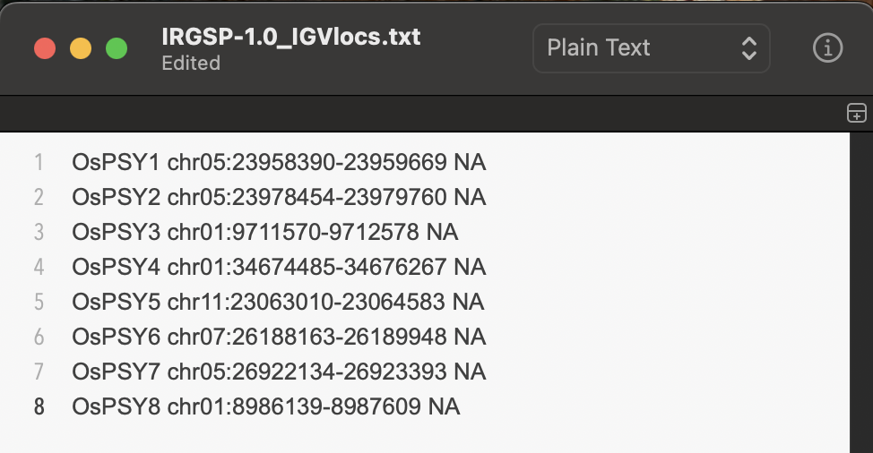
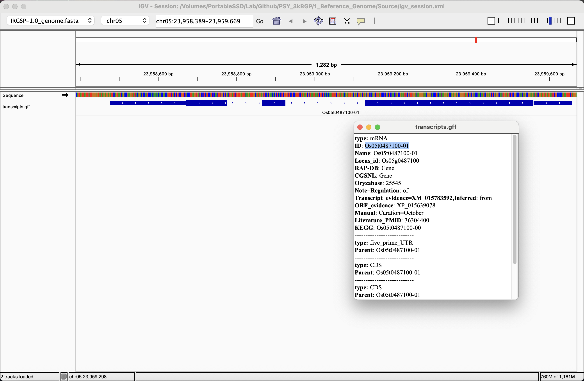
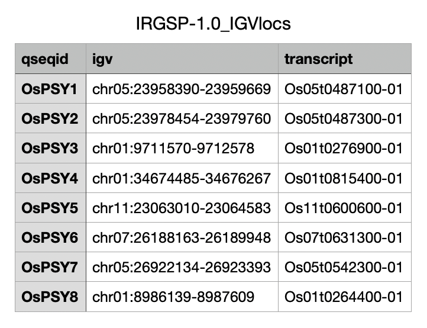
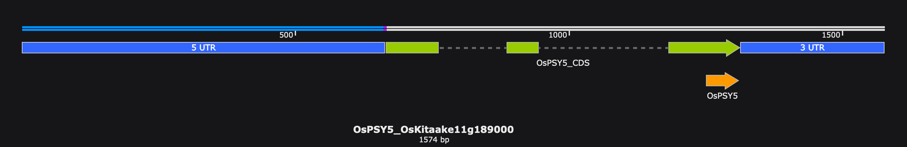
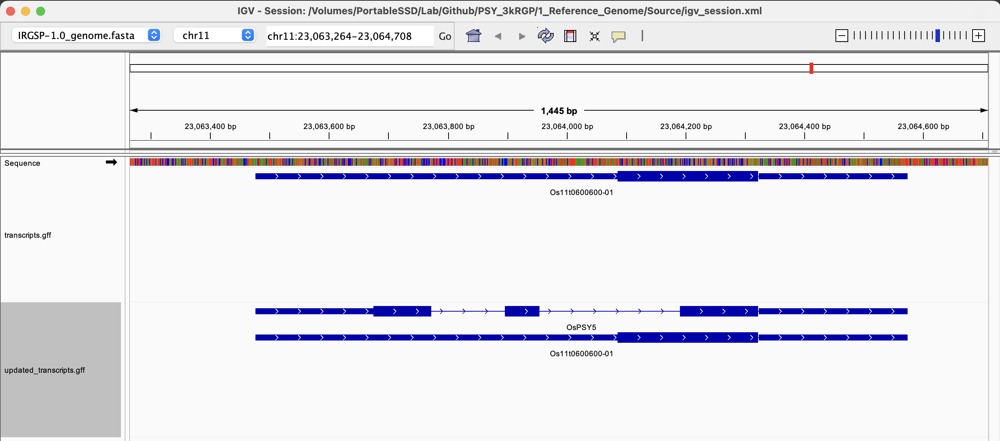

# Step 1: Identify regions of interest in reference genome

The 3kRGP has genomes aligned against the Nipponbare IRGSP-1.0 reference genome. Since the sample genomes were assembled relative to Nipponbare, we first need to figure out where in the Nipponbare genome our genes of interest are located. Take your time verifying the region you are pulling from and ensure the region is accurately annotated so you life will be easier down the road!

## Download the Nipponbare genome assembly and annotation
First, we need the reference genome and annotations.

```{bash}

	sbatch Scripts/download_reference.sh

```

## Set up the IGV genome browser
Once everything is downloaded, set up an IGV profile to look at sample alignments. [IGV](https://igv.org/doc/desktop/#DownloadPage/) is a genome browser that helps visualize genome annotations and sequence alignments.
1. Open IGV and select "Genomes > Load genome from file”. Select the **IRGSP-1.0_genome.fa** file (downloaded to the "Source" directory).  Once loaded on IGV, the IRGSP-1.0 genome should show up in the browser and be available to select from the drop-down list of genomes.
2. Load in genome annotations by selecting “File > Load from file” and choosing your annotation file. I like the **transcripts.gff** file (found in the "Source/IRGSP-1.0_representative" directory).
3. After setting your browser up, you can save your session by creating an IGV profile. Select “File > Save session” and name the session file whatever you’d like. Save this file to a directory you will remember (such as the "Source" directory). If you add any new annotations or alignments to this session, make sure to re-save the session file before closing IGV! To re-load your session, go to “File > Open session” and select the .xml session file you saved.

*Note: If you move your genome, annotations, sequence files, or .xml session file to a different directory then the session will no longer load properly in IGV, so make sure these files stay where they are when you save your session.*

## Collect or create Nipponbare genome annotations for genes of interest
Next, use BLAST to search for your genes of interest within the Nipponbare reference genome. Input all your sequences as a FASTA file into the script (Mine is called **OsPSY_vars.fa**, found in the "Source" directory. You can use any other FASTA you prefer).
```{bash}

	sbatch Scripts/blast_reference.sh Source/OsPSY_vars.fa

```

The **blast_cleanup.R** script is used next to identify the top BLAST hit for each sequence. These are saved to a spreadsheet named **IRGSP-1.0_IGVlocs.csv** in the "Output" directory.

```{r}

	Scripts/blast_cleanup.R

```

<center>

</center>

With this set of genomic regions, we should check that they look correct. My query sequences came from Kitaake, so I aligned my top hits against the Kitaake sequences to make sure they looked similar.

|Sequence|Location|% Identity to Kitaake|
|:---:|:---:|:---:|
|OsPSY1|chr05:23958390-23959669|99.8%|
|OsPSY2|chr05:23978454-23979760|99.8%|
|OsPSY3|chr01:9711570-9712578|98.2%|
|OsPSY4|chr01:34674485-34676267|99.8%|
|OsPSY5|chr11:23063010-23064583|99.9%|
|OsPSY6|chr07:26188163-26189948|99.9%|
|OsPSY7|chr05:26922134-26923393|99.8%|
|OsPSY8|chr01:8986139-8987609|99.4%|

I also used IGV to see what the transcript name for each gene region was. To do this, I pasted the genomic location into the search bar of the browser, then clicked on the blue transcript associated with that region. The popup window lists the transcript name. 

<center>

</center>

I manually updated my **IRGSP-1.0_IGVlocs.csv** spreadsheet to include the associated transcript IDs.

<center>

</center>

It's important to note that sometimes genomes are not as well-annotated as you want them to be. A genomic region may not have any associated transcript annotations, or maybe the annotation for a particular gene doesn't look quite right. For example, the transcript for OsPSY5 (Os11t0600600-01) contains a single exon. When we compare this annotation to the Kitaake OsPSY5 transcript (OsKitaake11g189000), this seems to be inaccurate. 

<center>

</center>

<center>

</center>

If this happens, you can manually write your own genome annotations. Genome annotations are in [GFF format](https://en.wikipedia.org/wiki/General_feature_format), which is a text file of tab-separated values. The data I collected looked like this:
|chromosome|source|feature|start|end|score|strand|phase|attributes|
|:---:|:---:|:---:|:---:|:---:|:---:|:---:|:---:|:---:|
|chr11|self-annotation|mRNA|23063476|23064575|.|+|.|ID=OsPSY5|
|chr11|self-annotation|CDS|23063675|23063771|.|+|0|Parent=OsPSY5|
|chr11|self-annotation|CDS|23063896|23063954|.|+|2|Parent=OsPSY5|
|chr11|self-annotation|CDS|23064191|23064322|.|+|0|Parent=OsPSY5|

I formatted this data to fit GFF requirements and saved it as **OsPSY5_Nipponbare.gff** in the "Source" directory. I then combined this annotation with the IRGSP-1.0 annotation and saved it as **updated_transcripts.gff** in the "Source" directory.

```{bash}

	cat Source/IRGSP-1.0_representative/transcripts.gff Source/OsPSY5_Nipponbare.gff > Source/updated_transcripts.gff 

```

When I go back onto IGV and load **updated_transcripts.gff** into my session, I can see that my annotated gene is now included in the browser. Yay!

*Note: By default, IGV will have all transcript annotations overlap into a single track. To show all annotations in a region clearly, right-click the annotation track and select the "Expanded" option.*

<center>

</center>

Since this manual annotation is what I want to use in my genome search, I can update the spreadsheet with the new OsPSY5 ID.

<center>

</center>
